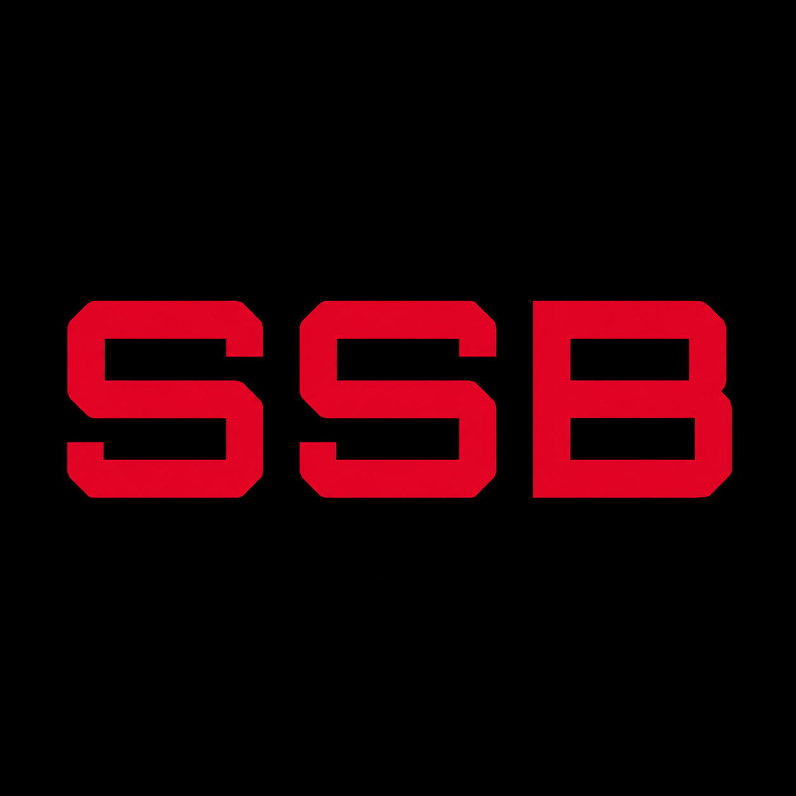

<p align="center">
  
</p>

<h1 align="center">StalzoneServerBlocker</h1>

<p align="center">
  Открытая утилита Windows для управления доступом к выбранным игровым и промежуточным серверам STALZONE через Windows Firewall.
</p>

<p align="center">
  <strong>Windows 10/11 · x64 · C++20 · Win32 API</strong>
</p>

## ❤️ Поддержка автора
Игровой ник - Kwokwiy

## Статус использования

Автор проекта получил положительный ответ технической поддержки EXBO относительно описанного принципа работы программы.

Это подтверждение относится к функциональности, переданной поддержке на проверку: отдельная системная утилита блокирует выбранные IP-адреса стандартными правилами Windows Firewall и не вмешивается в процесс или файлы игры.

> [!IMPORTANT]
> Проект не является официальным продуктом EXBO, не разрабатывается EXBO и не означает официального партнёрства или поддержки проекта компанией. Пользователь обязан соблюдать актуальное лицензионное соглашение и правила игры. При изменении функциональности программы или правил STALZONE статус допустимости необходимо уточнять повторно.

## Подтверждение технической поддержки EXBO

Автор проекта получил положительный ответ технической поддержки EXBO относительно описанного принципа работы программы.

[Посмотреть ответ технической поддержки EXBO](docs/exbo-permission.jpg)

## Возможности

- загрузка списка серверов из встроенного `Servers.json`;
- отображение серверов по группам в виде дерева;
- выбор отдельных серверов или всей группы;
- блокировка выбранных IPv4-адресов в обоих направлениях;
- блокировка TCP, UDP и остальных IP-протоколов на всех портах;
- применение правил ко всем активным профилям и сетевым интерфейсам Windows;
- принудительное завершение существующих TCP-соединений с выбранными IP;
- восстановление состояния галочек из реально действующих правил Firewall;
- сохранение блокировки после закрытия программы и перезагрузки Windows;
- удаление только тех правил, которые созданы программой;

## Как это работает

После нажатия `BLOCK SELECTED` программа создаёт два правила Windows Firewall:

```text
STALZONE Server Blocker - ALL Outbound
STALZONE Server Blocker - ALL Inbound
```

Параметры правил:

- действие: `BLOCK`;
- протокол: `ANY`;
- направления: входящее и исходящее;
- локальные адреса: все;
- удалённые адреса: выбранные IPv4-адреса;
- порты: все;
- профили: Domain, Private и Public;
- типы сетевых интерфейсов: все;
- привязка к конкретному EXE отсутствует.

Правила являются общесистемными. Если другая программа подключается к тому же IP, её соединение также будет заблокировано.

После создания правил существующие IPv4 TCP-соединения с выбранными адресами завершаются через системный Windows API. UDP не имеет постоянного состояния соединения, поэтому все последующие UDP-пакеты к выбранным адресам отбрасываются Firewall.

> [!WARNING]
> Если заблокировать IP текущего сервера во время активной игровой сессии, соединение с ним будет потеряно. Сначала убедитесь, что выбран правильный адрес.

## Что программа не делает

StalzoneServerBlocker:

- не открывает и не анализирует процесс `stalzonew.exe`;
- не читает и не изменяет память игры;
- не внедряет DLL или другой код;
- не устанавливает драйверы и системные хуки;
- не изменяет игровые файлы;
- не перехватывает и не модифицирует содержимое пакетов;
- не использует прокси, VPN или подмену DNS;
- не создаёт искусственную задержку;
- не автоматизирует игровой процесс и действия пользователя;
- не отправляет телеметрию;
- не подключается к серверам разработчика программы;
- не работает как фоновая служба и не добавляется в автозагрузку.

## Системные требования

- 64-битная Windows 10 или Windows 11;
- включённый Windows Defender Firewall;
- права администратора;
- для самостоятельной сборки — Visual Studio 2022 с компонентом **Desktop development with C++** и Windows SDK.

Программа использует статическую Release-сборку C++ (`/MT`), поэтому отдельная установка Microsoft Visual C++ Redistributable для готового EXE не требуется.

## Установка

1. Откройте раздел [Releases](../../releases).
2. Скачайте `StalzoneServerBlocker.exe` из последнего выпуска.
3. Проверьте SHA-256 файла по контрольной сумме, указанной в Release.
4. Запустите EXE и подтвердите запрос прав администратора.

Скачивайте готовые сборки только из раздела Releases этого репозитория. Исходный код GitHub автоматически предоставляет отдельно для каждого выпуска.

Неподписанный новый EXE может показывать предупреждение Windows SmartScreen из-за отсутствия репутации цифровой подписи. Это не требует отключения Windows Defender или других средств защиты.

## Использование

1. Запустите программу от имени администратора.
2. Разверните нужную группу серверов.
3. Отметьте галочками отдельные серверы или всю группу.
4. Нажмите `BLOCK SELECTED`.
5. Дождитесь сообщения об успешном создании и проверке правил.
6. Для полного снятия блокировки нажмите `REMOVE BLOCKS`.

Галочка означает, что IP присутствует одновременно в активных входящем и исходящем правилах программы. Простое выделение строки в дереве ничего не блокирует.

## Ручное удаление правил

Если интерфейс программы недоступен:

1. Нажмите `Win + R`.
2. Введите `wf.msc`.
3. Откройте входящие и исходящие правила.
4. Удалите правила с именами:

```text
STALZONE Server Blocker - ALL Outbound
STALZONE Server Blocker - ALL Inbound
```

Не удаляйте другие правила Windows Firewall.

## Servers.json

Основной список серверов встроен внутрь EXE. Если рядом с программой находится внешний `Servers.json`, он имеет приоритет и позволяет обновить список без перекомпиляции.

Пример структуры:

```json
{
  "mode": "roxy",
  "pools": [
    {
      "name": "MSK2",
      "region": "RU",
      "tunnels": [
        {
          "name": "MSK2-1",
          "address": "95.213.255.12:29450"
        }
      ]
    }
  ]
}
```

Порт используется для отображения. Правило Firewall блокирует весь указанный IP на всех портах.

Перед публикацией обновлённого `Servers.json` проверяйте происхождение и актуальность каждого адреса.

## Сборка из исходного кода

1. Установите Visual Studio 2022.
2. В Visual Studio Installer добавьте компонент **Desktop development with C++**.
3. Клонируйте репозиторий или скачайте его исходный код.
4. Откройте `StalzoneServerBlocker.sln`.
5. Выберите конфигурацию `Release` и платформу `x64`.
6. Выполните **Build → Rebuild Solution**.
7. Готовый файл будет создан здесь:

```text
build\Release\StalzoneServerBlocker.exe
```

Все необходимые данные встраиваются в EXE:

- `Servers.json`;
- шрифт Orbitron;
- лицензия шрифта;
- иконка приложения.

## Структура проекта

```text
StalzoneServerBlocker/
├── fonts/
│   ├── OFL.txt
│   ├── Orbitron-Regular.ttf
│   └── Orbitron-SemiBold.ttf
├── app.ico
├── app.png
├── main.cpp
├── README.md
├── resource.h
├── Servers.json
├── SETUP.md
├── StalzoneServerBlocker.rc
├── StalzoneServerBlocker.sln
├── StalzoneServerBlocker.vcxproj
└── StalzoneServerBlocker.vcxproj.filters
```

## Сохранение настроек

Тема и выбранная цветовая палитра сохраняются для текущего пользователя Windows:

```text
HKEY_CURRENT_USER\Software\Kwokwiy\StalzoneServerBlocker
```

Состояние заблокированных IP не дублируется в реестре. Оно определяется по фактическому содержимому правил Windows Firewall.

## Конфиденциальность

Программа не собирает и не передаёт:

- данные аккаунта;
- имя персонажа;
- историю подключений;
- содержимое сетевого трафика;
- аппаратные идентификаторы;
- диагностические или аналитические данные.

В программе отсутствуют телеметрия, реклама, автоматическое обновление и удалённое управление.

## Безопасность

Программа запрашивает права администратора, поскольку без них Windows не разрешает создавать общесистемные правила Firewall и завершать TCP-соединения.

Перед установкой готовой сборки рекомендуется:

- скачивать EXE только из официального Release репозитория;
- сверять SHA-256;
- при необходимости самостоятельно собрать EXE из опубликованных исходников;
- не использовать сборки, перепакованные третьими лицами.

Сообщения об уязвимостях следует отправлять автору приватно, не публикуя инструкции по эксплуатации проблемы до выпуска исправления.

## Лицензирование

Условия использования исходного кода определяются файлом `LICENSE` в корне репозитория. До добавления этого файла действуют стандартные авторские права автора проекта.

## Автор

`by.Kwokwiy`

Шрифт Orbitron распространяется отдельно по лицензии SIL Open Font License. Её текст находится в `fonts/OFL.txt`.

## Товарные знаки

STALZONE, EXBO и связанные названия принадлежат их соответствующим правообладателям. StalzoneServerBlocker — независимый пользовательский проект и не является официальным клиентом, модификацией или продуктом EXBO.
